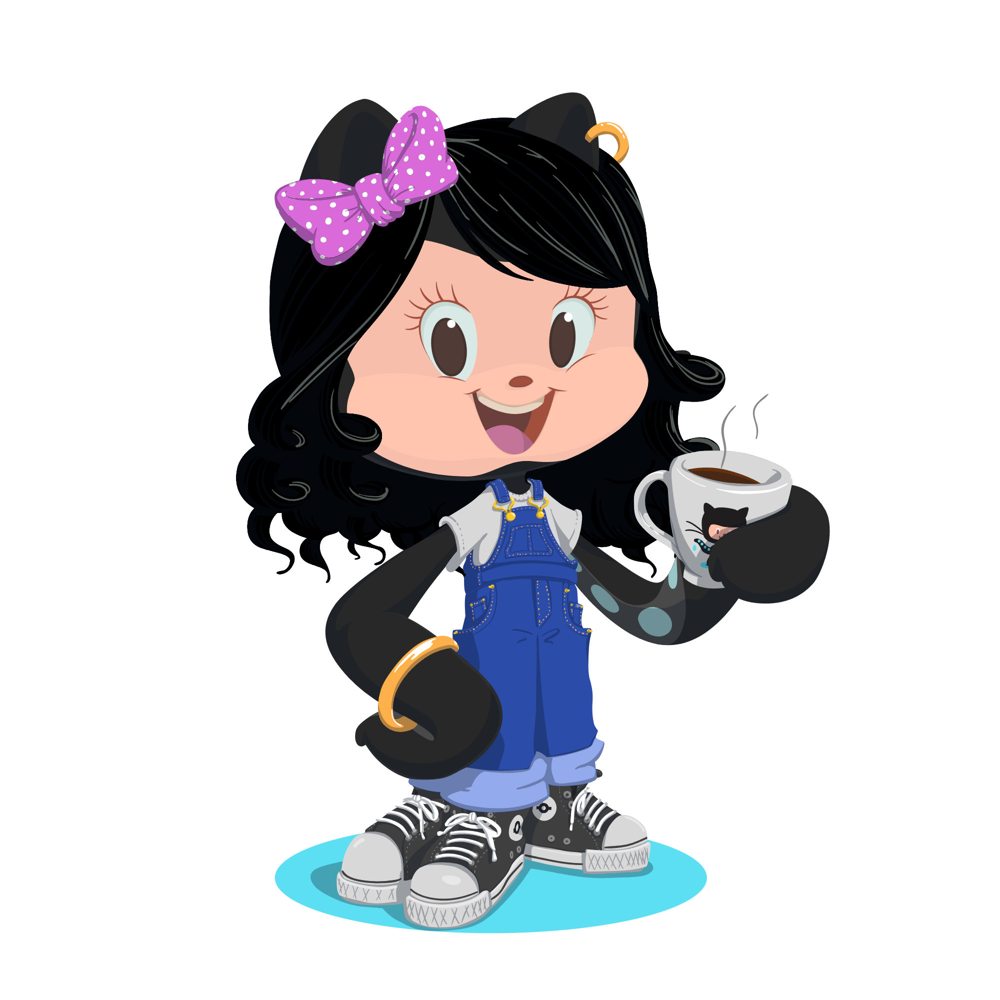

<div align="center">
  
  # Seja bem - vindo.👋
  </div>
  
<div>
  
  ```java
Desenvolvedor JuliaOJustino = new Desenvolvedor(

      nome = "Julia Justino",
      curso = "Ciências da computação",
      local = "São Paulo - SP"
);

 System.out.println("Olá, sou Julia Justino. -  👩🏻‍💻 ")
```
</div>


<div id="txtp" align = "left">
<br><h2>Sobre mim</h2>
  <p>  Olá, eu sou Stephany Julia de Oliveira Justino mas pode me chamar de Julia. Desde que me entendo por gente, sempre gostei de criar e aprender coisas novas. Quando novos desafios apareceram decidi me apoiar nos estudos e assim acabei passando na ETEC (Escola Tecnica Estadual) e iniciei o ensino médio integrado ao técnico de Desenvolvimento de Sistemas.</p>
  
  <p>  Em 2020, logo descobri minha verdadeira vocação. Desde então aprendi a programar, conceber e desenvolver projetos e aprender com cada um deles.</p>
  <p>  Em 2023 conquistei mais um passo na minha carreira. Comecei a cursar Ciências da computação pela instituição SPTECH 🎓. <br>
  Meu desejo é evoluir nos estudos cada vez mais. </p>  
</div>

<div align = "left">
  
  ## Estou estudando:
<code></code>
<code></code>
<code></code>
<code></code>
<code></code>
<code></code>
<code></code>
<code></code>
<code></code>
<code></code>
</div>


  
## Minha atividade no github
 <div align="center">
  <a href="https://github.com/JuliaOJustino">
  
    
  
</div>

<br>

## Minhas missões 🚀
- [x] Estudar 📚.
- [x] Se dedicar ▶️.
- [x] Praticar 🖖.
- [x] Aprender 📖.
- [x] Evoluir⭐.
      
<div align=center>
  <h2><b>📍 Quantidade de visitas </b></h2>
</div>
    
<p align="center" >   
    
</p>


          
